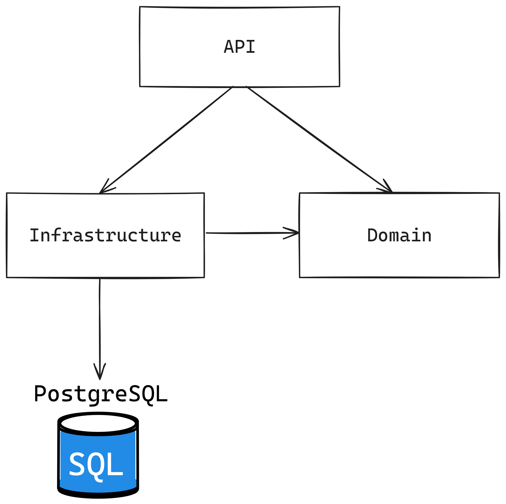

# Coding Test

This repo contains a coding test for Ria Money Transfer. It uses .NET 8 for all projects and can be run using the .NET CLI, Visual Studio 2022, or Docker. To run any of the projects below using the .NET CLI or Docker, the first step is to open the terminal and navigate to the project folder from one of the exercises. From inside this repo folder, you can run the following command to enter an exercise folder:

```bash
cd Exercise01
```

Or:

```bash
cd Exercise02
```

The `Running locally` section of this README expects that you already have a terminal opened in the correct folder to run the project.

## Exercise 01

### Running locally

To run the first exercise, you can run the following commands depending on the way chosen for running the application:

1. Using the .NET CLI:

```bash
dotnet run --project ./src/Exercise01.Console/Exercise01.Console.csproj
```

2. Using Docker Compose:

```bash
docker-compose up --build
```

### Thought process

For this exercise, my approach was to test the combinations with the smallest cartridge possible and, from there, start adding to the combination higher cartridges. 

### Suggestions for algorithm logic improvements

Currently, the algorithm assumes that the input is a number divisible by 10, but an improvement could be made to accept any number. If the cartridge combination can’t reach the exact amount, the algorithm would return all possible combinations along with the remaining amount that can’t be achieved using these cartridges.

For example, using 105 as an input, the algorithm would return all the combinations and the remaining `5`, which could not be dispensed with the available cartridges.

## Exercise 02

### Tech stack

The REST API uses .NET 8 and PostgreSQL to persist customer data. It has unit and integration tests using NUnit and uses some common libraries like Fluent Validation, Fluent Assertions, and ErrorOr.

I’ve opted not to use migrations since the project only has a single table to save customer data. The table creation happens at the same time that the PostgreSQL container starts using a SQL script that is inside de `sql` folder.

For integration tests, the project uses the built-in `WebApplicationFactory` from .NET and uses TestContainers to spin up a PostgreSQL Docker container.

List of external libraries used:

- For the application: Entity Framework, Npgsql, Fluent Validation, and ErrorOr;
- For the tests: TestContainers, Respawn, Fluent Assertions, Bogus, and FakeItEasy.

### Running locally

For the second exercise, we have two projects: the REST API and the Request Simulator. You can run them using the following commands depending on the way chosen for running the application:

1. To run the REST API using the .NET CLI:

```bash
dotnet run --project ./src/Exercise02.API/Exercise02.API.csproj
```

2. To run the Request Simulator using the .NET CLI:

```bash
dotnet run --project ./src/Exercise02.HttpSimulator/Exercise02.HttpSimulator.csproj
```

3. Using Docker Compose, this will spin up the PostgreSQL database, the REST API and the Request Simulator:

```bash
docker-compose up -d --build
```

Any of the options above will run the API at http://localhost:8080/. You can check the Swagger page at http://localhost:8080/swagger/index.html.

Optionally, you can run only the PostgreSQL container if you choose to run the application using Visual Studio. To run only the database container, run the following command:

```bash
docker-compose up -d postgres
```

### Running the tests

It's possible to execute the tests using the .NET CLI with the following command:

```bash
dotnet test
```

This command runs both the unit and the integration tests.

### Architecture

#### REST API



For the first part of exercise 02, the REST API, I chose a layered architecture with 3 layers:

- API: This layer is the HTTP interface and has the endpoints related to the customer;
- Domain: This layer has all the logic for customer validation and insertion, along with all the entities;
- Infrastructure:  This layer has a database connection with PostgreSQL and Entity Framework configuration.

I selected this architecture because it facilitates unit and integration testing by separating dependencies according to their concerns.

To make the internal array insertion thread-safe I’ve used a `lock` statement. I've decided to use a singleton for the internal customer array so that the program maintains the array in memory for every request.

#### Request simulator

For the second part of exercise 02, the request simulator, I chose to go with a simple console project that creates 500 POST and GET HTTP requests to the REST API. 

To generate random data, I had to create a wrapper for the built-in `Random` class since the implementation is not thread-safe, and to generate the incremental ID, I've used the `Interlocked.Increment()` method.

### Suggestions for algorithm logic improvements

Currently, the insertion algorithm doesn’t have a rule to decide the insertion position when two participants share the same first and last name. An improvement could be adding a new rule to sort by age or ID if participants share de exact same name.

### Related projects

I have a similar REST API project on my GitHub that uses almost the same technologies, with the addition of Kubernetes. If you are interested, you can check it out here: https://github.com/LucasRufo/transfer-hub-api.